# Web Application Document - Projeto Individual - Módulo 2 - Inteli

## Nome do Projeto
Estuda+

#### Autor do projeto
Nicole Riedla Paiva Neves

## Sumário

1. [Introdução](#c1)  
2. [Visão Geral da Aplicação Web](#c2)  
3. [Projeto Técnico da Aplicação Web](#c3)  
4. [Desenvolvimento da Aplicação Web](#c4)  
5. [Referências](#c5)  

<br>

## <a name="c1"></a>1. Introdução (Semana 01)

O *Estuda+* é uma aplicação web desenvolvida com o propósito de auxiliar estudantes na organização e no planejamento de suas atividades acadêmicas. Diante de uma rotina intensa e, muitas vezes, desorganizada, a plataforma surge como uma solução eficiente para centralizar informações relacionadas às matérias e tarefas escolares em um único ambiente digital.

Por meio do sistema, os usuários podem cadastrar suas matérias e associar tarefas específicas a cada uma delas, definindo prazos e acompanhando o status de execução (como pendente, em andamento ou concluída). Dessa forma, a aplicação proporciona uma visão clara e objetiva da rotina de estudos, permitindo que o estudante visualize seu progresso e priorize suas demandas com mais assertividade. Espera-se, assim, que o uso do Estuda+ promova o desenvolvimento da disciplina, da gestão do tempo e da autonomia — competências essenciais para o sucesso acadêmico.

A estrutura do sistema foi concebida com base na arquitetura MVC (Model-View-Controller), a qual permite uma organização eficiente do código, separando a lógica de negócio (model), a interface com o usuário (view) e o controle das requisições (controller). O backend da aplicação foi implementado utilizando Node.js e o framework Express, garantindo flexibilidade e bom desempenho. Para a camada de visualização, foi adotado o motor de templates EJS, que possibilita a renderização dinâmica das páginas. Além disso, o banco de dados PostgreSQL foi escolhido por sua robustez, segurança e compatibilidade com o modelo relacional proposto na modelagem.

---

## <a name="c2"></a>2. Visão Geral da Aplicação Web

### 2.1. Personas (Semana 01 - opcional)

*Posicione aqui sua(s) Persona(s) em forma de texto markdown com imagens, ou como imagem de template preenchido. Atualize esta seção ao longo do módulo se necessário.*

### 2.2. User Stories (Semana 01 - opcional)

*Posicione aqui a lista de User Stories levantadas para o projeto. Siga o template de User Stories e utilize a referência USXX para numeração (US01, US02, US03, ...). Indique todas as User Stories mapeadas, mesmo aquelas que não forem implementadas ao longo do projeto. Não se esqueça de explicar o INVEST de 1 User Storie prioritária.*

---

## <a name="c3"></a>3. Projeto da Aplicação Web

### 3.1. Modelagem do banco de dados  

O banco de dados foi desenvolvido com base no modelo relacional, uma abordagem que organiza os dados em tabelas interligadas, garantindo consistência, integridade e facilidade de acesso às informações. 

A seguir, serão apresentados os modelos relacionais que compõem o banco de dados da aplicação, acompanhados de uma explicação detalhada sobre cada tabela e seus respectivos relacionamentos.

<div style="text-align: center;" align="center">
    <sub>Figura 1 - Modelo Relacional do Banco de Dados</sub>
</div>
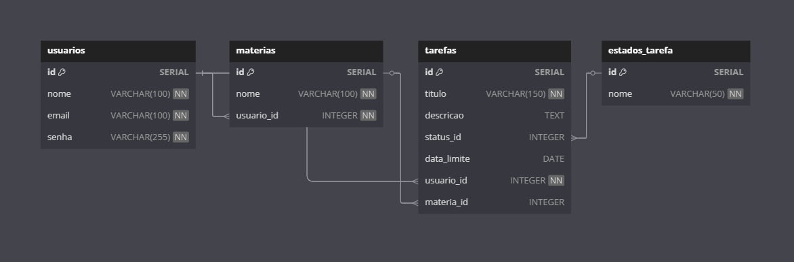
<div style="text-align: center; " align="center">
    <sup>Fonte: Autoria própria (2025)</sup>
</div>

---

##### Tabela: `usuarios`

Armazena os dados dos usuários cadastrados.

- `id`: Identificador único do usuário (chave primária).
- `nome`: Nome completo do usuário.
- `email`: Endereço de e-mail único.
- `senha`: Senha criptografada para login.

##### Tabela: `estados_tarefa`

Define os diferentes estados que uma tarefa pode assumir (ex: pendente, em andamento, concluída).

- `id`: Identificador único do estado (chave primária).
- `nome`: Nome do estado (valor único).

##### Tabela: `materias`

Representa as matérias registradas por cada usuário.

- `id`: Identificador único da matéria (chave primária).
- `nome`: Nome da matéria.
- `usuario_id`: Referência ao usuário que criou a matéria (`usuarios.id`).

##### Tabela: `tarefas`

Contém as tarefas cadastradas pelos usuários.

- `id`: Identificador único da tarefa (chave primária).
- `titulo`: Título da tarefa.
- `descricao`: Descrição detalhada.
- `status`: Situação da tarefa (ex: pendente, concluída).
- `data_limite`: Data de entrega da tarefa.
- `usuario_id`: Referência ao usuário responsável (`usuarios.id`).
- `materia_id`: Referência à matéria associada (`materias.id`).

---

#### Relacionamentos

Os relacionamentos entre as tabelas são definidos da seguinte forma:

- **Usuário → Matérias (1:N):** <br>
  Um único usuário pode cadastrar várias matérias. No entanto, cada matéria está sempre vinculada a apenas um usuário. Isso garante que o sistema saiba quem é o dono de cada matéria.

- **Matéria → Tarefas (1:N):** <br>
  Uma matéria pode ter várias tarefas associadas. Assim, o usuário pode organizar suas tarefas com base em cada disciplina cadastrada.

- **Usuário → Tarefas (1:N):** <br>
  Cada usuário pode criar diversas tarefas. Essa ligação permite que o sistema identifique quais tarefas pertencem a qual usuário.

- **Estado de tarefa → Tarefa (1:N):** <br>
  Cada tarefa tem um único estado (por exemplo, "pendente", "em andamento" ou "concluída"), mas um mesmo estado pode ser usado por várias tarefas diferentes.

---

Além disso, a seguir, tem-se o arquivo referente à modelagem física do banco de dados, o qual define a estrutura real das tabelas no sistema gerenciador de banco de dados (SGBD). Esse script em SQL permite a criação das tabelas conforme a modelagem proposta, garantindo a integridade referencial e a correta organização dos dados.

Acessar arquivo: [Código](../scripts/init.sql)

```sql
-- Tabela: usuarios
CREATE TABLE usuarios (
    id SERIAL PRIMARY KEY,
    nome VARCHAR(100) NOT NULL,
    email VARCHAR(100) UNIQUE NOT NULL,
    senha VARCHAR(255) NOT NULL
);

-- Tabela: estados_tarefa
CREATE TABLE estados_tarefa (
    id SERIAL PRIMARY KEY,
    nome VARCHAR(50) NOT NULL UNIQUE
);

-- Tabela: materias
CREATE TABLE materias (
    id SERIAL PRIMARY KEY,
    nome VARCHAR(100) NOT NULL,
    usuario_id INTEGER NOT NULL,
    FOREIGN KEY (usuario_id) REFERENCES usuarios(id) ON DELETE CASCADE
);

-- Tabela: tarefas
CREATE TABLE tarefas (
    id SERIAL PRIMARY KEY,
    titulo VARCHAR(150) NOT NULL,
    descricao TEXT,
    status_id INTEGER,
    data_limite DATE,
    usuario_id INTEGER NOT NULL,
    materia_id INTEGER,
    FOREIGN KEY (usuario_id) REFERENCES usuarios(id) ON DELETE CASCADE,
    FOREIGN KEY (materia_id) REFERENCES materias(id) ON DELETE SET NULL,
    FOREIGN KEY (status_id) REFERENCES estados_tarefa(id) ON DELETE SET NULL
);
```


### 3.1.1 BD e Models 

Foram implementadas três tabelas principais no banco de dados, refletidas diretamente nos Models da aplicação:

**Usuários**

- id: Identificador único do usuário.
- nome: Nome completo.
- email: Endereço de e-mail.
- senha: Senha criptografada.

**Matérias**

- id: Identificador único da matéria.
- nome: Nome da matéria (ex: Matemática, Física).
- usuario_id: ID do usuário que associou essa matéria ao seu perfil.

**Tarefas**

- id: Identificador único da tarefa.
- titulo: Título da tarefa.
- descricao: Detalhamento da tarefa.
- status: Situação da tarefa (ex: pendente, concluída).
- data_limite: Prazo de entrega da tarefa.
- usuario_id: ID do usuário responsável pela tarefa.
- materia_id: ID da matéria à qual a tarefa está associada.

### 3.2. Arquitetura (Semana 5)

 A imagem abaixo ilustra a estrutura básica da arquitetura MVC, mostrando a interação entre suas três camadas principais: Model, View e Controller.

 <div style="text-align: center;" align="center">
    <sub>Figura 2 - Arquitetura MVC</sub>
</div>
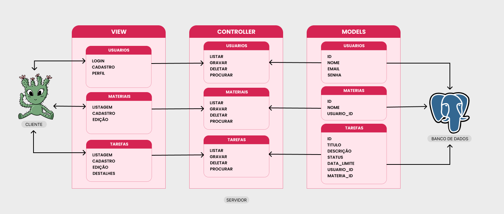
<div style="text-align: center; " align="center">
    <sup>Fonte: Autoria própria (2025)</sup>
</div>

**1. View (Frontend):**
- É a interface com a qual o usuário interage. Por exemplo: páginas de login, cadastro, visualização de tarefas e matérias.
- Envia requisições (como formulários) para o Controller.

**2. Controller (Lógica de Controle):**
- Recebe as requisições da View.
- Valida e processa os dados.
Chama os métodos do Model para ler/gravar dados no banco.
- Devolve a resposta (dados ou redirecionamento) para a View.

**3. Model (Lógica de Dados):**
- Contém a lógica de negócios da aplicação.
- Realiza operações no banco de dados (SELECT, INSERT, UPDATE, DELETE).
- Retorna os dados processados ao Controller.

### 3.3. Wireframes (Semana 03 - opcional)

*Posicione aqui as imagens do wireframe construído para sua solução e, opcionalmente, o link para acesso (mantenha o link sempre público para visualização).*

### 3.4. Guia de estilos (Semana 05 - opcional)

*Descreva aqui orientações gerais para o leitor sobre como utilizar os componentes do guia de estilos de sua solução.*


### 3.5. Protótipo de alta fidelidade (Semana 05 - opcional)

*Posicione aqui algumas imagens demonstrativas de seu protótipo de alta fidelidade e o link para acesso ao protótipo completo (mantenha o link sempre público para visualização).*

### 3.6. WebAPI e Endpoints 

Abaixo estão descritos todos os endpoints da WebAPI do sistema **Estuda+**, organizados por entidade (Tarefas, Usuários e Matérias). 

---

#### 🔹 Usuários

| Método | Rota              | Descrição                             | Parâmetros                                           |
|--------|-------------------|----------------------------------------|------------------------------------------------------|
| POST   | `/usuarios`       | Cria um novo usuário                   | Body: `{ nome, email, senha }`                       |
| GET    | `/usuarios`       | Lista todos os usuários                | —                                                    |
| GET    | `/usuarios/:id`   | Retorna os dados de um usuário         | Params: `id`                                         |
| PUT    | `/usuarios/:id`   | Atualiza os dados de um usuário        | Params: `id` <br> Body: `{ nome?, email?, senha? }` |
| DELETE | `/usuarios/:id`   | Remove um usuário                      | Params: `id`                                         |

---

#### 🔹 Matérias

| Método | Rota               | Descrição                              | Parâmetros                                             |
|--------|--------------------|------------------------------------------|--------------------------------------------------------|
| POST   | `/materias`        | Cria uma nova matéria                    | Body: `{ nome, usuario_id }`                           |
| GET    | `/materias`        | Lista todas as matérias                  | —                                                      |
| PUT    | `/materias/:id`    | Atualiza uma matéria                     | Params: `id` <br> Body: `{ nome?, usuario_id? }`       |
| DELETE | `/materias/:id`    | Remove uma matéria                       | Params: `id`                                           |

---

#### 🔹 Tarefas

| Método | Rota            | Descrição                     | Parâmetros                                                                 |
|--------|------------------|-------------------------------|----------------------------------------------------------------------------|
| POST   | `/tarefas`       | Cria uma nova tarefa          | Body: `{ titulo, descricao, status, data_limite, usuario_id, materia_id }` |
| GET    | `/tarefas`       | Lista todas as tarefas        | —                                                                          |
| PUT    | `/tarefas/:id`   | Edita uma tarefa existente    | Params: `id` <br> Body: `{ titulo?, descricao?, status?, data_limite?, usuario_id?, materia_id? }` |
| DELETE | `/tarefas/:id`   | Exclui uma tarefa             | Params: `id`                                                               |

---

### 3.7 Interface e Navegação (Semana 07)

O frontend do Estuda+ foi desenvolvido utilizando EJS para renderização dinâmica das páginas, exibindo dados reais do sistema, como tarefas e matérias cadastradas pelo usuário. Todas as páginas contam com estilização própria em CSS, garantindo uma navegação intuitiva e visual agradável.

A integração entre frontend e backend é realizada principalmente por meio da fetch API, que permite operações assíncronas como cadastro, edição e exclusão de dados sem recarregar a página. O layout foi projetado para ser intuitivo, com menus claros e feedback visual imediato para as principais ações do usuário.

A estrutura MVC foi mantida durante todo o desenvolvimento, separando claramente as responsabilidades entre modelos, controladores, views e rotas. O sistema pode ser executado facilmente com `npm start` ou `node server.js`, permitindo o gerenciamento completo das informações pelo usuário.

A tela de login permite que o usuário acesse o sistema informando seu e-mail e senha cadastrados. Caso ainda não possua uma conta, há um link para a tela de cadastro.

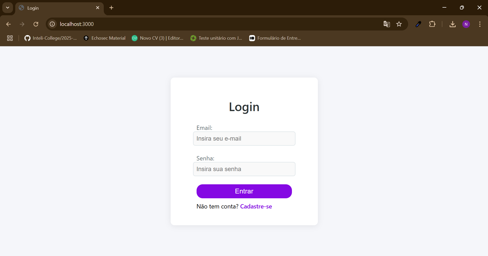

Na tela de cadastro, o usuário pode criar uma nova conta informando nome, e-mail e senha. Após o cadastro, é possível acessar o sistema normalmente.

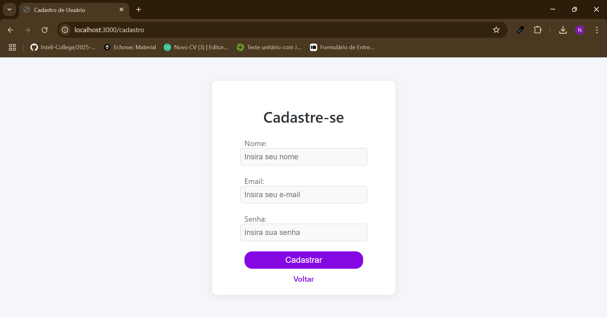

Após o login, o usuário é direcionado para a tela de gerenciamento de tarefas, onde pode visualizar todas as tarefas cadastradas, seus status, prazos e matérias associadas. É possível editar ou excluir tarefas diretamente nesta tela.

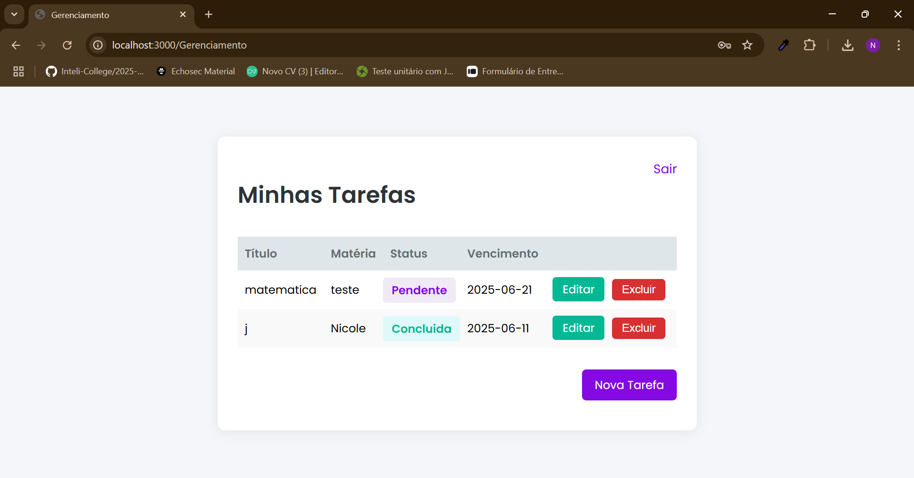

A tela de edição de tarefa permite alterar os detalhes de uma tarefa já cadastrada, como título, descrição, status, data limite e matéria relacionada.

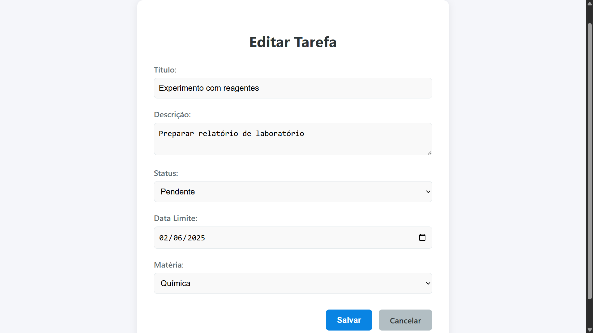

Na tela de criação de tarefa, o usuário pode adicionar uma nova tarefa ao sistema, preenchendo os campos obrigatórios e associando a tarefa a uma matéria específica.

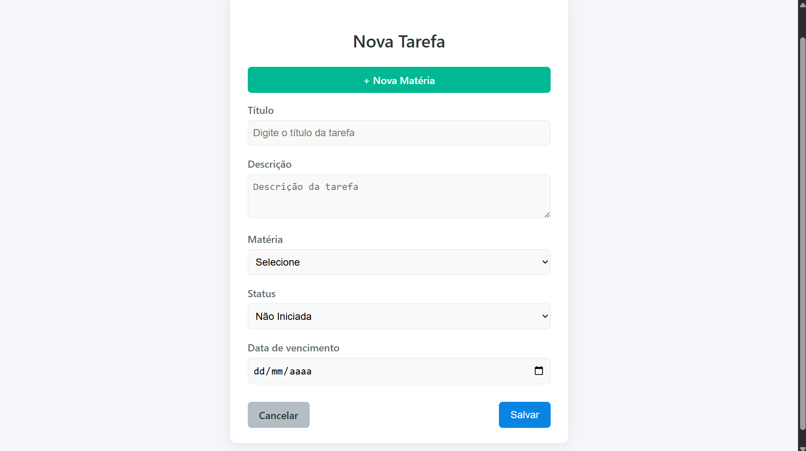

A tela de criação de matéria possibilita ao usuário cadastrar novas matérias, que poderão ser associadas às tarefas posteriormente, facilitando a organização dos estudos.

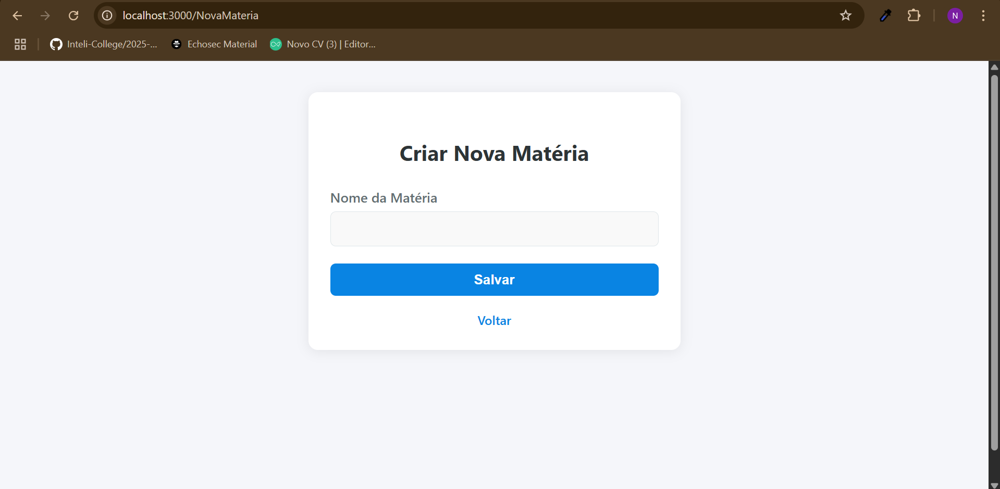

---

#### Versão Mobile das Telas

Abaixo, estão as versões mobile das principais telas do sistema, demonstrando a responsividade e adaptação da interface para dispositivos móveis:

**Login (Mobile)**

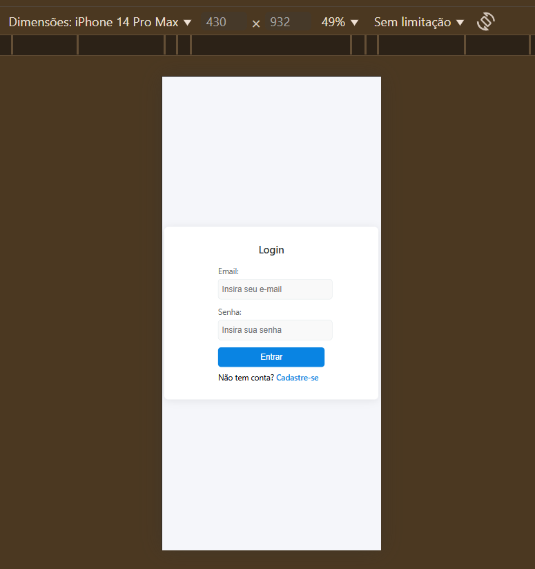

**Cadastro (Mobile)**

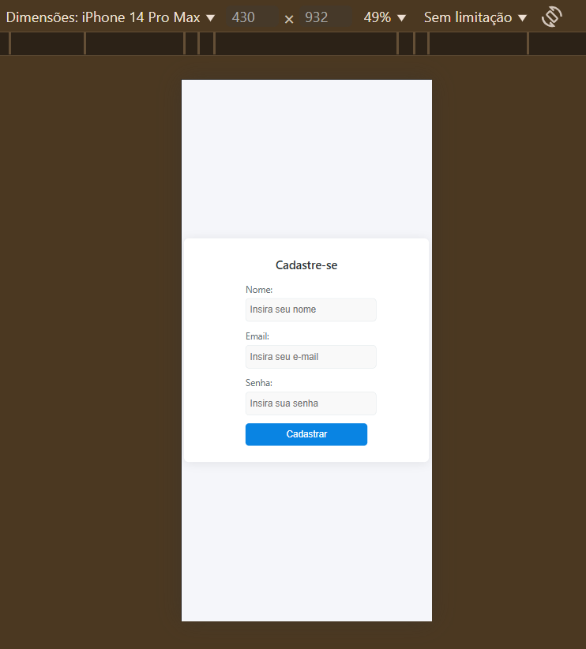

**Gerenciamento de Tarefas (Mobile)**

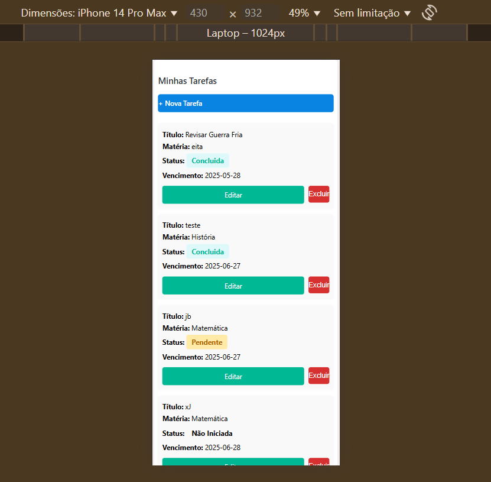

**Edição de Tarefa (Mobile)**

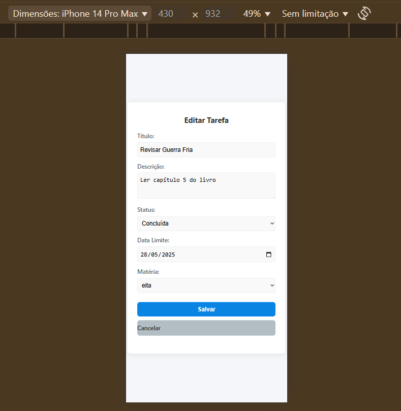

**Criação de Tarefa (Mobile)**

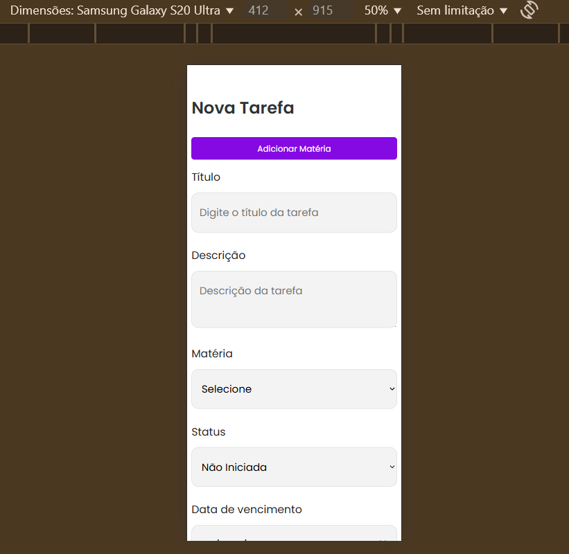

**Criação de Matéria (Mobile)**

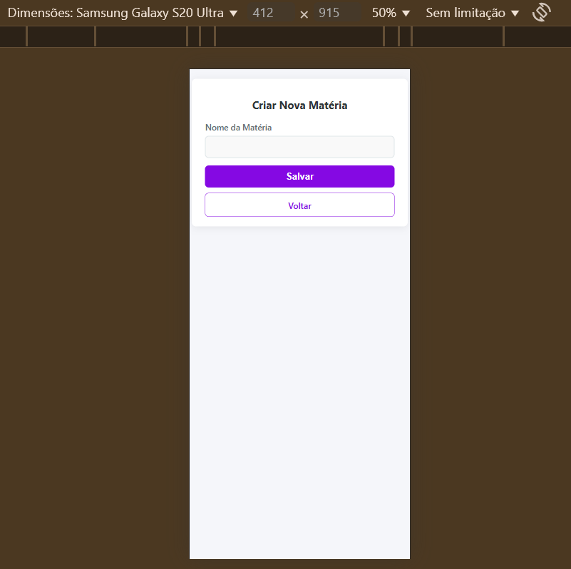

As versões mobile das telas foram desenvolvidas utilizando media queries em CSS, garantindo que a interface se adapte automaticamente a diferentes tamanhos de tela e proporcionando uma experiência de uso confortável tanto em computadores quanto em dispositivos móveis.

---

## <a name="c4"></a>4. Desenvolvimento da Aplicação Web (Semana 8)

### 4.1 Demonstração do Sistema Web (Semana 8)

*VIDEO: Insira o link do vídeo demonstrativo nesta seção*
*Descreva e ilustre aqui o desenvolvimento do sistema web completo, explicando brevemente o que foi entregue em termos de código e sistema. Utilize prints de tela para ilustrar.*

### 4.2 Conclusões e Trabalhos Futuros

**Pontos fortes**

- Arquitetura MVC bem definida, facilitando manutenção.
- Interface responsiva, usável tanto em desktop quanto mobile.

**Pontos a melhorar**

- Implementar mensagens para notificações de tarefas vencidas.
- Refinar experiência do usuário com feedbacks em tempo real.

**Ideias Futuras**

- Integração com calendário Google/Outlook para sincronizar datas‑limite.
- Tema escuro/claro automático via preferências do sistema.


## <a name="c5"></a>5. Referências

_Incluir as principais referências de seu projeto, para que o leitor possa consultar caso ele se interessar em aprofundar._<br>

---
---