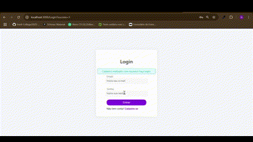
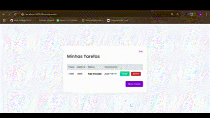
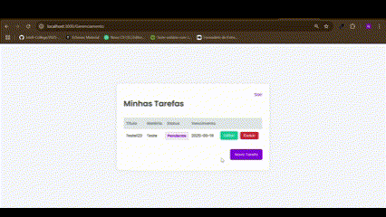

# Estuda+

**Estuda+** é uma plataforma projetada para ajudar estudantes a gerenciar suas tarefas acadêmicas e monitorar o progresso de seus estudos. O sistema permite o cadastro de matérias e tarefas associadas, bem como o acompanhamento do estado de cada tarefa (pendente, em andamento ou concluída). O objetivo é oferecer uma interface simples e intuitiva para organizar o trabalho acadêmico, promovendo mais eficiência no dia a dia dos alunos.


#### Funcionalidades principais:
- Cadastro de usuários com informações pessoais e credenciais de login.
- Cadastro de matérias vinculadas aos usuários.
- Cadastro de tarefas associadas a matérias, com status e data limite.
- Acompanhamento do status das tarefas (pendente, em andamento, concluída).

#### Estrutura de Pastas e Arquivos

A estrutura do projeto é organizada da seguinte forma:


```
Project1/
│
├── config/                # Arquivos de configuração (ex: conexão com banco)
│   └── db.js
├── controllers/           # Lógica de controle das requisições
│   └── userController.js
├── models/                # Definição de modelos de dados (estrutura do banco)
│   └── userModel.js
├── routes/                # Definição das rotas do sistema
│   └── index.js
├── services/              # Serviços auxiliares do sistema
│   └── userService.js
├── assets/                # Arquivos públicos como imagens e fontes
├── scripts/               # Arquivos de JavaScript públicos
│   └── Codigo.sql
├── styles/                # Arquivos CSS públicos
├── tests/                 # Arquivos de testes unitários
│   └── example.test.js
├── .gitignore             # Arquivo para ignorar arquivos no Git
├── .env                   # Arquivo de exemplo para variáveis de ambiente
├── jest.config.js         # Arquivo de configuração do Jest
├── package-lock.json      # Gerenciador de dependências do Node.js
├── package.json           # Gerenciador de dependências do Node.js
├── readme.md              # Documentação do projeto (Markdown)
├── server.js              # Arquivo principal que inicializa o servidor
└── rest.http              # Teste de endpoints (opcional)

```


## Como Executar o Projeto Localmente

### Requisitos

- Node.js (versão 22.13.1)
- PostgreSQL (versão 17.4.1)

### Instalação

1. **Clone o repositório**:

```
git clone https://github.com/nicriedla/Project1.git
cd Project1
```

2. **Instale as dependências**:
Na pasta do projeto, execute o seguinte comando para instalar as dependências necessárias:

```
npm install
```
3. **Configurar o arquivo `.env`:**
    
 Configure o arquivo `.env` com as variáveis de ambiente necessárias, com as configurações do banco de dados PostgreSQL.

````
DB_USER=seu_usuario
DB_HOST=localhost
DB_DATABASE=postgres
DB_PASSWORD=sua_senha
DB_PORT=5432
DB_SSL=true
PORT=3000
````

Configuração do Banco de Dados
------------------------------

1. **Criar banco de dados:**
    
    Crie um banco de dados PostgreSQL com o nome especificado no seu arquivo `.env`.
    
2. **Executar o script SQL de inicialização:**
    
```bash
npm run init-db
```
    
Isso criará as tabelas no seu banco de dados PostgreSQL.
    
Testando as APIs com o Postman
------------------------------

Aqui estão exemplos de chamadas que você pode testar no Postman:

**Usuários**

*Criar usuário:* POST http://localhost:3000/usuarios
```
{
  "nome": "João Silva",
  "email": "joao@email.com",
  "senha": "senha123"
}
```

*Listar todos os usuários:* GET http://localhost:3000/usuarios

*Buscar usuário por ID:* GET http://localhost:3000/usuarios/1

*Atualizar usuário:* PUT http://localhost:3000/usuarios/1
```
{
  "nome": "Maria Eduarda Souza",
  "email": "maria.souza@email.com",
  "senha": "novaSenha456"
}
```

*Excluir usuário:* DELETE http://localhost:3000/usuarios/1

--- 

**Matérias**

*Criar matéria:* POST http://localhost:3000/materias
```
{
  "nome": "Matemática",
  "usuario_id": 1
}
```

*Listar matérias:* GET http://localhost:3000/materias

*Editar matéria:* PUT http://localhost:3000/materias/1
```
{
  "nome": "Matemática Avançada",
  "usuario_id": 1
}
```

*Excluir matéria:* DELETE http://localhost:3000/materias/1

---

**Tarefas**

*Criar tarefa:* POST http://localhost:3000/tarefas
```
{
  "titulo": "Estudar para a prova",
  "descricao": "Revisar os capítulos 1 a 3",
  "status": "pendente",
  "data_limite": "2025-05-30",
  "usuario_id": 1,
  "materia_id": 1
}
```

*Listar tarefas:* GET http://localhost:3000/tarefas

*Editar tarefa:* PUT http://localhost:3000/tarefas/1
```
{
  "titulo": "Estudar estatística",
  "descricao": "Focar nos capítulos 4 a 6",
  "status": "fazendo",
  "data_limite": "2025-06-05",
  "usuario_id": 1,
  "materia_id": 1
}
```

*Excluir tarefa:* DELETE http://localhost:3000/tarefas/1

---

Fluxos da Interface
-------------

| Tela | Descrição |
|------|-----------|
|  | **Cadastro:** criação de conta pelo usuário. |
|  | **Login:** autenticação de usuários existentes. |
|  | **Nova Tarefa:** preenchimento de formulário e salvamento. |
|  | **Edição:** alteração de dados de uma tarefa existente. |
|  | **Exclusão:** remoção de tarefa da lista do usuário. |

---

Funcionalidades
---------------

* **Padrão MVC:** Estrutura organizada em Model, View e Controller.
* **PostgreSQL:** Banco de dados relacional utilizado para persistência dos dados.
* **UUID:** Utilização de UUID como chave primária nas tabelas.
* **Scripts com `nodemon`:** Utilização do `nodemon` para reiniciar automaticamente o servidor após alterações no código.
* **Testes:** Inclui estrutura básica para testes automatizados.

---

## Tecnologias Utilizadas

| Camada | Tecnologias |
|--------|-------------|
| **Back‑end** | Node.js v22.13.1, Express.js, Sequelize ORM |
| **Banco de Dados** | PostgreSQL (via Supabase) |
| **Infraestrutura** | Supabase (hospedagem do banco), GitHub (repositório) |

---

Scripts Disponíveis
-------------------

* `npm start`: Inicia o servidor Node.js.
* `npm run dev`: Inicia o servidor com `nodemon`, reiniciando automaticamente após alterações no código.
* `npm run test`: Executa os testes automatizados.
* `npm run test:coverage`: Executa os testes e gera um relatório de cobertura de código.

Estrutura de Diretórios
-----------------------

* **`config/`**: Configurações do banco de dados e outras configurações do projeto.
* **`controllers/`**: Controladores da aplicação (lógica de negócio).
* **`models/`**: Modelos da aplicação (definições de dados e interações com o banco de dados).
* **`routes/`**: Rotas da aplicação.
* **`tests/`**: Testes automatizados.
* **`views/`**: Views da aplicação (se aplicável).

Contribuição
------------

Contribuições são bem-vindas! Sinta-se à vontade para abrir um issue ou enviar um pull request.

Licença
-------